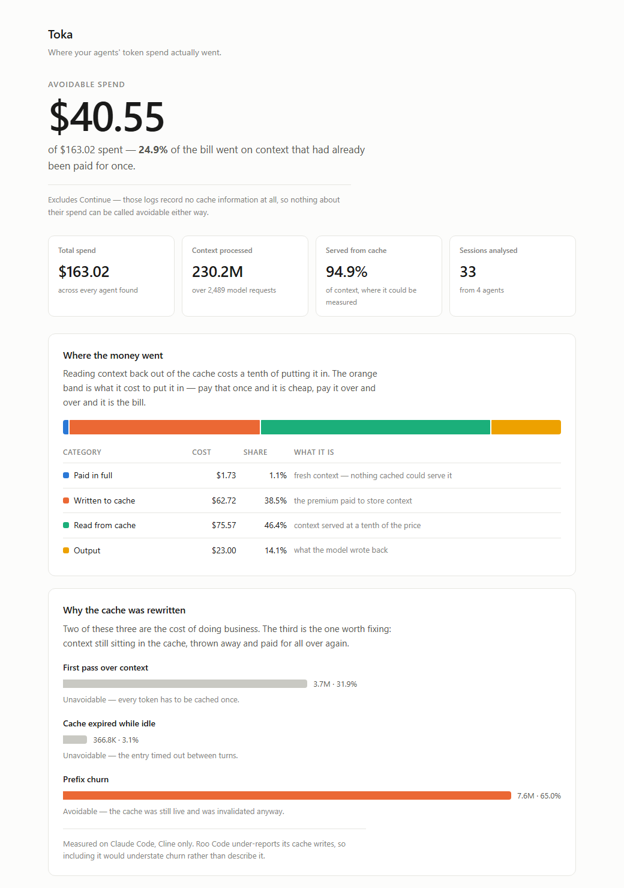

# Toka

[](https://github.com/smaan712gb/TOKA/actions/workflows/ci.yml)
[](https://pypi.org/project/tokameter/)
[](https://pypi.org/project/tokameter/)
[](LICENSE)

**Find out how much of your AI agent bill you didn't need to pay.**

Agents don't get expensive because models are expensive. They get expensive
because the same context is sent, and paid for, over and over. Toka reads the
logs your tools already write and tells you how much of that was avoidable —
and exactly what to change.

It runs on your machine, reads local files, and talks to no network. Nothing
about your code or your prompts leaves your computer.

<picture>
  <source media="(prefers-color-scheme: dark)" srcset="docs/dashboard-dark.png">
  
</picture>

<sub><i>`toka --compare --html` on synthetic data. Every figure is generated by
<a href="docs/make_demo.py">docs/make_demo.py</a> — real numbers are your own and
never leave your machine.</i></sub>

---

## Does this apply to you?

If you use any of these, yes — Toka reads them with no configuration:

| You use | Toka reads |
| --- | --- |
| **Claude Code** | your session transcripts |
| **Claude Desktop** (agent mode) | its local session store |
| **Cline**, **Roo Code**, **Kilo Code** | their task history — in VS Code, **Cursor**, **Windsurf**, VSCodium or Trae |
| **Continue** | its `dev_data` telemetry |
| **Aider** | the chat history file in your project |
| **Gemini CLI**, **Codex CLI** | their session directories |

If you call a model API directly — OpenAI, Anthropic, DeepSeek, OpenRouter,
Gemini, or anything behind a gateway — nothing writes a log for you, so
[one line of code](#agents-that-keep-no-logs) records it instead.

Using something else entirely? Point Toka at its logs and it will very likely
read them anyway — see [teaching Toka a new agent](#teaching-toka-a-new-agent).
You do not need to wait for an adapter.

**Requirements:** Python 3.10 or newer. No other dependencies, ever.

---

## Install

```bash
pip install tokameter
```

The command is `toka` and the import is `import toka`.

> **Why `tokameter` and not `toka`?** The name `toka` on PyPI belongs to an
> unrelated project, so `pip install toka` would get you something else
> entirely. Only the package name differs — everything you type is `toka`.

---

## Start here

```bash
toka
```

That's the whole quickstart. It finds your Claude Code logs, reads them, and
prints where the money went. If you use something else, run `toka --compare`
and it will find every agent on the machine instead.

```text
  sessions analysed               38
  model requests              36,861
  total cost              $11,149.30

WHERE THE MONEY WENT
  fresh input (1.0x)                  $9.46     0.1%
  cache writes (1.25-2.0x)        $2,628.11    23.6%
  cache reads (0.1x)              $7,391.98    66.3%
  output                          $1,119.76    10.0%

  rewrites by cause
    first pass over context       17.3M     7.5%
    TTL expiry (idle gap)         44.6M    19.3%
    prefix churn                 169.8M    73.3%

RECOVERABLE                      $1,754.40    15.7% of spend
```

**How to read that.** Sending context to a model costs full price the first
time. Providers then cache it, and reading it back costs a tenth as much — so
a well-behaved agent pays once and reads cheaply forever after. The number
that matters is **prefix churn**: context that was still sitting in the cache,
thrown away, and paid for from scratch. That is the avoidable part, and on
this machine it was three quarters of every rewrite.

Other things you can do:

```bash
toka path/to/logs/        # any directory of transcripts
toka session.jsonl        # a single file
toka --project my-repo    # only sessions from one project
toka --top 20             # the 20 most expensive sessions
toka --out report.txt     # save the report
```

Formats are detected automatically — you never name one.

---

## Compare your agents

```bash
toka --compare
```

Finds every agent on the machine, runs the same analysis over each, and puts
them side by side.

```text
  agent           sessions  requests  prompt tok  hit rate  recoverable
  --------------------------------------------------------------------------
  Claude Code           38    36,861      11.31B     97.9%        15.7%
  Cline                410    22,137       2.96B     59.3%        59.9%
  Claude Desktop        60     6,558       1.20B     92.0%        33.5%
  Continue               1        29       97.9K not logged            —

  Spread: Claude Code holds 97.9% of its prompt tokens in cache;
          Cline holds 59.3%. Same job, 39 points apart.
```

**Cache hit rate is the number to compare.** It measures how an agent builds
its prompts — whether the context survives between turns — and not what you
happened to ask it to do. Token counts and cost are *not* comparable: they
tell you how much you used each tool, not how well it was built.

**`not logged` is not a zero.** A tool that records no cache information at
all scores 0% on arithmetic alone, which would rank a perfectly good tool last
on no evidence. Those rows show `—` and are left out of the ranking entirely.

---

## Share it with people who don't read terminals

```bash
toka --compare --html spend.html
```

Writes one self-contained HTML page — no scripts, no network, nothing to
host. It leads with the number that matters, explains where the money went and
why the cache was rewritten, and says plainly what it could not measure. Open
it in a browser or send it to whoever signs off on the bill.

---

## Find out *what* broke the cache

The report tells you churn is costing you. This tells you which bytes did it,
which is the part no dashboard can give you.

```python
from toka import PrefixGuard

guard = PrefixGuard()          # one per conversation

report = guard.check(system=system, tools=tools, messages=messages)
if not report.stable:
    print(report.explain())
```

```text
prefix broke at turn 2 — 100% of the cached prefix invalidated (390 chars)
  segment: system[0]
  cause:   looks like a timestamp
  before:  ...Current date: 2026-08-19T10:33:01Z\nYou are a coding assistant...
  after:   ...Current date: 2026-08-19T10:34:15Z\nYou are a coding assistant...
  note:    system renders before messages, so all history was lost too

  Move volatile content out of the system prompt and into a later message,
  after the last cache breakpoint.
```

It runs offline against the request you are about to send — no API call, no
key, nothing leaves the process. Growth by appending is never reported as a
break, so it stays quiet until something actually goes wrong. It also knows a
change in `tools` costs more than the same change in `messages`, because tools
are sent first and take the whole prompt down with them.

`check()` returns a `CheckReport` — `stable`, `invalidated_pct` and the
offending `break_` — so you can assert on it in a test rather than read it.
`render()` exposes the same segmentation if you want to inspect the prefix
yourself, and `sorted_keys_warning(tools)` catches a subtler problem the guard
cannot see for you: if your own JSON serialiser does not sort keys, the bytes
change between turns even when your tools do not.

---

## Fix it

```python
from toka import repair_safely

fixed = repair_safely(system=system, tools=tools, messages=messages)
print(fixed.explain())

response = client.messages.create(
    system=fixed.system, tools=fixed.tools, messages=fixed.messages, ...
)
```

```text
[tier 1] applied: tools (get_weather, search) — key order normalised so
                  serialisation is byte-stable
[tier 1] applied: system (last block) — cache_control added at the
                  tools+system boundary

Not applied — these change what the model reads:
  system[0] at offset 14 — looks like a timestamp ('2026-08-19T10:33:01Z')
  — every change to it invalidates the whole prompt.
```

**Tier 1 is applied for you, because it provably cannot change your results.**
Key order is invisible to the model and very visible to the cache;
`cache_control` is an instruction to the provider, not content. `verify()`
re-renders both versions and checks the model-visible text is byte-identical,
and `repair_safely()` raises rather than hand you a result that fails that
check. The breakpoint goes on the last system block, which caches your tools
along with it; with no system prompt it goes on the last tool instead.

**Tier 2 is never applied.** Moving a timestamp out of your system prompt is
the single biggest win available, and it moves text your model was conditioned
on. That is a judgement call about your prompt, so Toka describes it and
stops. Tool definitions are scanned too, including nested schema descriptions,
and flagged harder — a date that varies inside a tool takes the system prompt
and the entire conversation with it.

Both functions return a `RepairResult` carrying the rewritten `system`,
`tools` and `messages` alongside `applied` and `proposed` lists. Your own
objects are never modified.

A repair pass that saves 20% and breaks one task in fifty is a bad trade, and
token metrics alone will happily call it a win.

---

## Agents that keep no logs

Everything above reads something a tool already wrote down. If your code calls
a model API directly, nothing does — so record it yourself:

```python
import toka

response = client.messages.create(...)
toka.log(response)
```

That's it. It appends a record to `~/.toka` and returns; `toka` and
`toka --compare` pick it up from there. Anthropic, OpenAI, DeepSeek and Google
responses are all understood, as SDK objects or plain dicts. Call
`toka.new_session()` when a new conversation starts — waste is measured within
a conversation, and merging unrelated ones understates it.

It never raises. A metrics call that throws inside a request handler is worse
than no metrics, so failures return `None`, warn once, and carry on. Pass
`strict=True` if you would rather know loudly.

---

## Teaching Toka a new agent

You do not need an adapter, and you do not need to wait for one. Any tool that
writes JSON containing token counts can be read today — Toka finds the counts
by shape, at any depth.

Point it at the logs once:

```bash
toka --scan /path/to/your/tool/logs --compare
```

Or tell it permanently, by creating `~/.toka/agents.json`:

```json
{
  "My Agent": "{home}/.myagent/sessions",
  "Team Gateway": ["/var/log/llm-gateway", "{home}/exports"]
}
```

Those entries are added to the built-in locations, never replace them. The
same placeholders the built-ins use — `{home}`, `{app_support}`, `{cwd}`,
`{toka_home}` — work here, so one file is correct on Windows, macOS and Linux
alike. `TOKA_SCAN` takes paths the same way your system's `PATH` does, for
CI and one-off runs.

---

## What Toka refuses to tell you

This is the part that makes the rest trustworthy. Every source declares what
it can actually observe, and any claim that outruns the data is withheld
instead of estimated:

- **Cline** reports far more cache reads than writes. A read requires a prior
  write, so its write counts are incomplete — churn analysis is suppressed
  rather than reported as a reassuring 0%.
- **Continue** and **Aider** record no cache information at all. Their tokens
  are *not* counted as waste, because a log that never mentions caching is not
  evidence that caching failed.
- **GitHub Copilot** records no token accounting whatsoever — it bills a flat
  rate. There is deliberately no adapter; an adapter that produces nothing is
  worse than an honest gap.
- **Models with no published price** are counted in token totals and excluded
  from every dollar figure, rather than priced by analogy with a provider we
  do have rates for.

A tool that tells you you're fine using data it doesn't have is worse than one
that says nothing.

**One caveat that matters:** only Anthropic bills cache writes separately. On
OpenAI and Google, cached tokens are simply discounted with no write premium,
so this particular kind of waste is *invisible in their billing data*. On
those providers Toka reports the cache-miss signal instead. Token accounting
is correct everywhere; the churn analysis is Anthropic-only until other
providers report writes.

---

## Supported agents

| Adapter | Covers | Verified against real traffic |
| --- | --- | --- |
| `toka-log` | Anything you call `toka.log()` on — direct API use, homegrown loops, gateways | yes — Toka writes it |
| `claude-code` | Claude Code and Claude Desktop agent-mode transcripts | yes |
| `cline` | Cline / Roo / Kilo task history, in any VS Code-derived editor | yes |
| `continue` | Continue `dev_data/tokensGenerated.jsonl` | yes |
| `openai-compatible` | The OpenAI API and every gateway mirroring its shape — LiteLLM, OpenRouter, Helicone, Langfuse exports, Azure | fixtures only |
| `gemini` | Google `usageMetadata` | fixtures only |
| `aider` | `.aider.chat.history.md` | **no — built from docs** |
| `generic` | Any JSON with token counts, found by field-name pattern at any depth. Last resort; always loses to a purpose-built adapter | by design |

**Verification status is not decoration.** Building the Cline adapter against
real files caught two bugs a format-guess would have shipped silently: Cline
is a *router*, so hardcoding a provider prices GPT tasks at Anthropic rates,
and routed model ids (`anthropic/claude-sonnet-4.5`) fell through to the
unpriced path entirely. Treat unverified adapters as provisional.

---

## How the numbers are computed

Both measurements are deliberately **lower bounds**. Toka would rather
under-report than sell you a number that doesn't survive scrutiny.

**Cache miss.** Context billed at full price that a warm cache would have
served at a tenth. A session's first request is excluded — it has no cache to
hit yet, so paying full price for it was unavoidable.

**Prefix churn.** In a well-built session the context only grows, and each
token is cached once, so total writes should land near the largest context the
session ever held. Writing several times that means the cache kept breaking.
Rewrites that followed an idle gap longer than the cache lifetime are
discounted first — those expired, and no amount of good engineering brings
them back. What remains was still live and got thrown away anyway.

Without that discount the headline reads about four points higher. It is in
there because a number that counts unavoidable re-warming as waste is a number
that falls apart the first time somebody checks it.

---

## Troubleshooting

**`toka` says it found no logs.** Run `toka --compare`, which searches every
known location rather than just Claude Code's. If your tool still isn't there,
point at it directly with `--scan`, or add it to `agents.json` above.

**It found my logs but reports no requests.** The files probably don't record
token usage — plenty of tools log conversations without it. There is nothing
to measure in that case, which is why Toka says so instead of guessing.

**A row says `not logged` or `—`.** That tool doesn't report cache
information. It is unmeasured, not failing. See
[what Toka refuses to tell you](#what-toka-refuses-to-tell-you).

**Nothing is sent anywhere, ever.** If you want to confirm that, the package
has no dependencies and no network code at all.

---

## Adding an adapter

One file and one registry line. Implement `detect` and `parse`, and return a
`Request` per billed model call:

```python
class MyAgentAdapter:
    name = "my-agent"
    provider = "openai"

    def detect(self, sample: list[dict]) -> float:
        # Confidence in 0.0–1.0. Return 0.0 for formats you don't own —
        # the registry picks the highest scorer, so guessing hurts.
        return 1.0 if "my_marker" in sample[0] else 0.0

    def parse(self, path: Path) -> Iterator[Request]:
        ...
```

Register it in `src/toka/adapters/__init__.py`. `tests/test_adapters.py` covers
the contract: detection must be exclusive, cached tokens must not be
double-counted, and providers with no write premium must report zero writes.

```bash
pip install -e ".[dev]"
pytest
```

Issues and adapters welcome — especially adapters built against real files
rather than documentation.

Apache 2.0.
